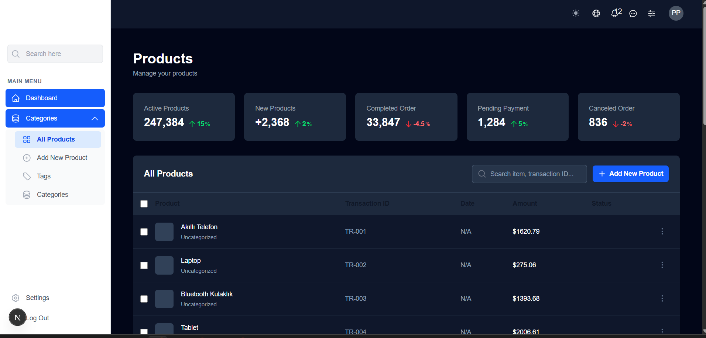

# Next.js Project

This is a [Next.js](https://nextjs.org) project bootstrapped with [`create-next-app`](https://nextjs.org/docs/pages/api-reference/create-next-app).

## Getting Started

First, run the development server:

```bash
npm run dev
# or
yarn dev
# or
pnpm dev
# or
bun dev

Open http://localhost:3000 with your browser to see the result.

You can start editing the page by modifying pages/index.js. The page auto-updates as you edit the file.

API routes can be accessed on http://localhost:3000/api/hello. This endpoint can be edited in pages/api/hello.ts.

The pages/api directory maps to /api/* endpoints instead of React pages.

This project uses next/font to automatically optimize and load the Geist font family.

## Screenshot
Here is an app screenshot:




Learn More
To learn more about Next.js, check out the following resources:

Next.js Documentation - learn about Next.js features and API.

Learn Next.js - an interactive tutorial.

You can also visit the Next.js GitHub repository — your feedback and contributions are welcome!

Deploy on Vercel
The easiest way to deploy your Next.js app is to use the Vercel Platform from the creators of Next.js.

See the Next.js deployment documentation for more details.

